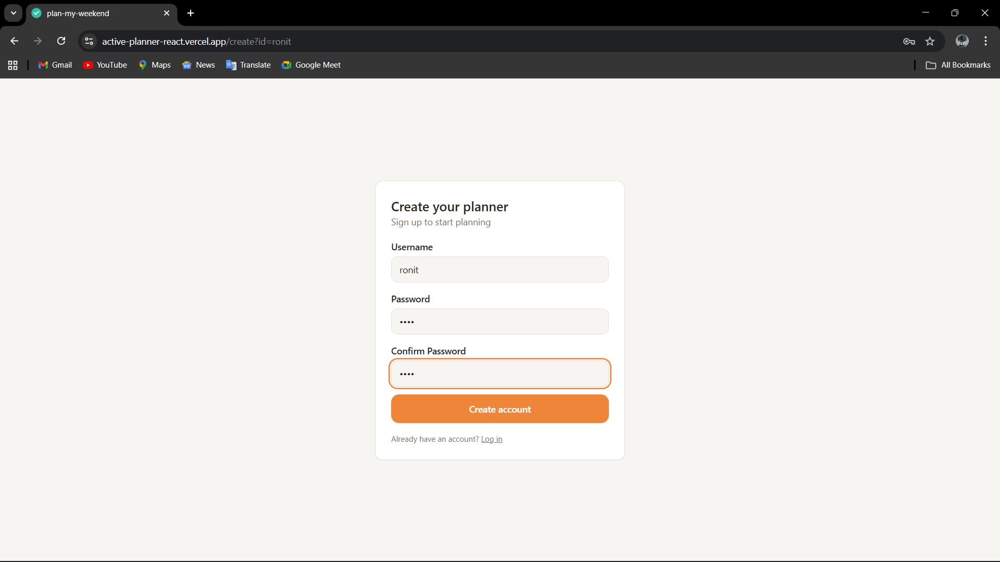
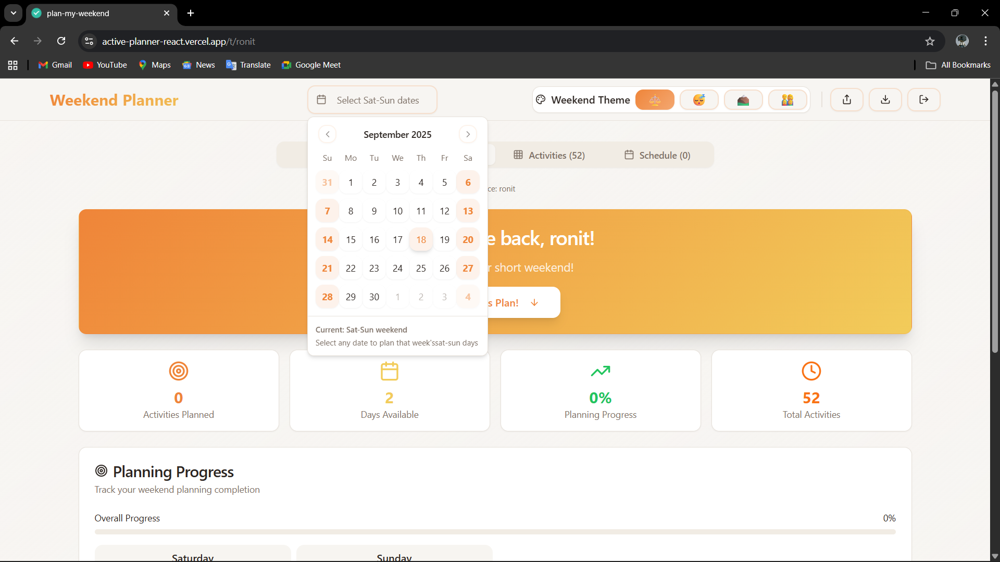
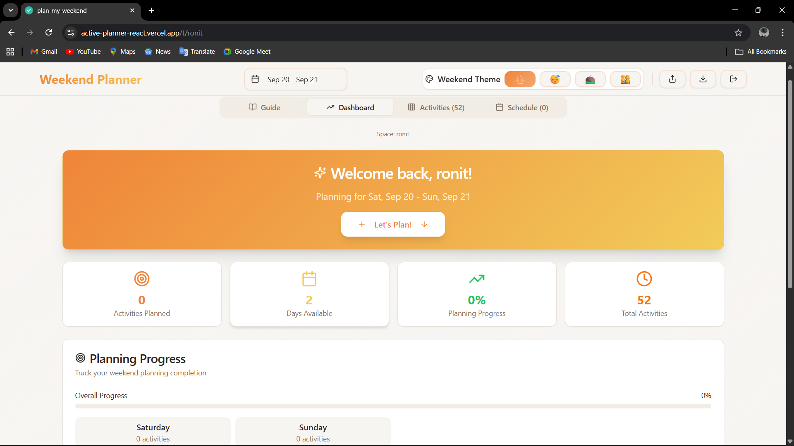
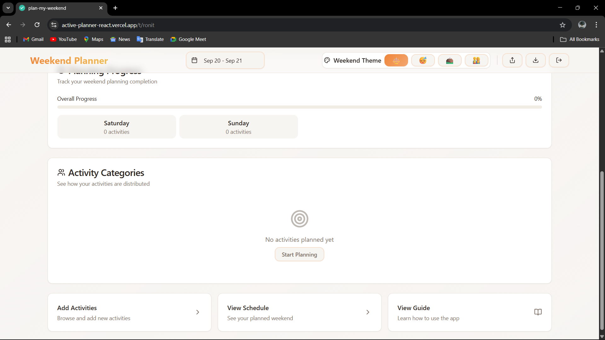
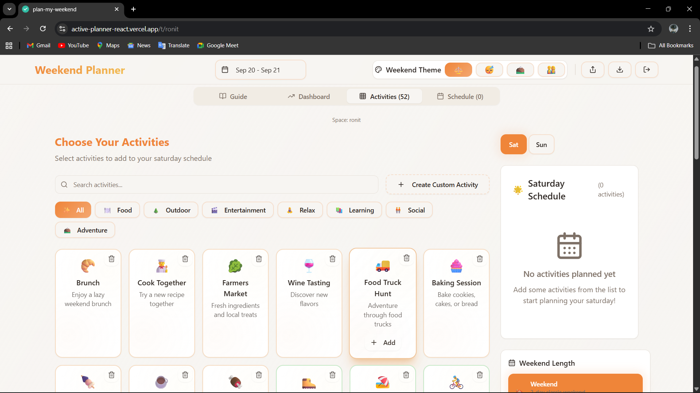
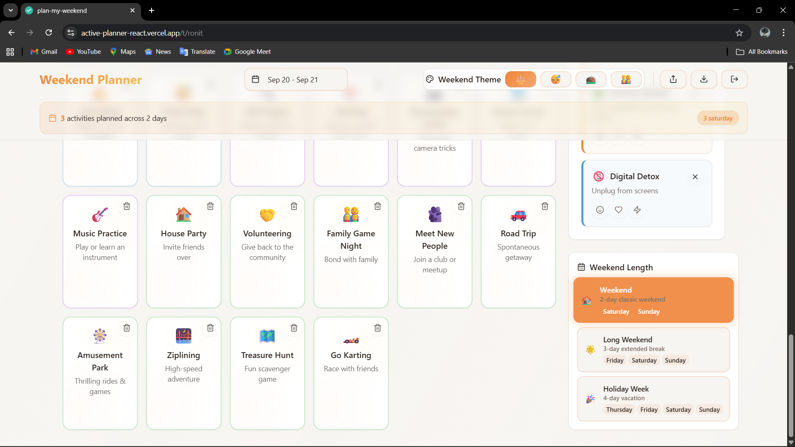
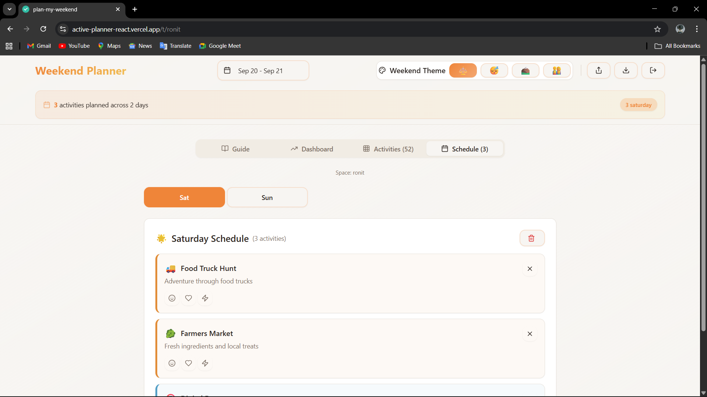
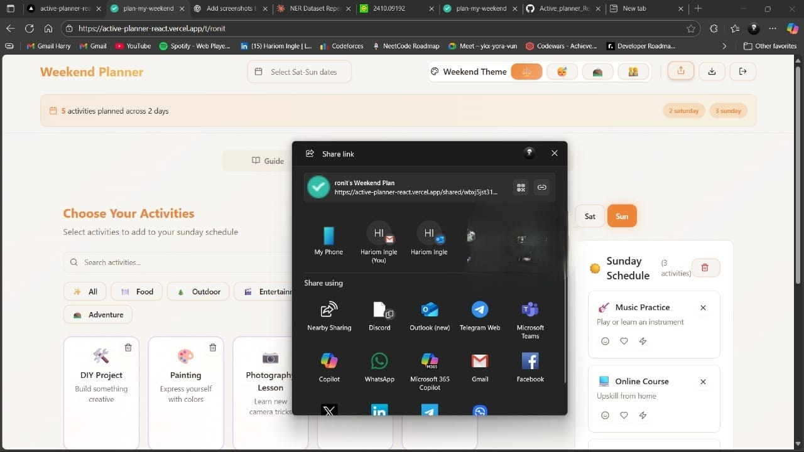
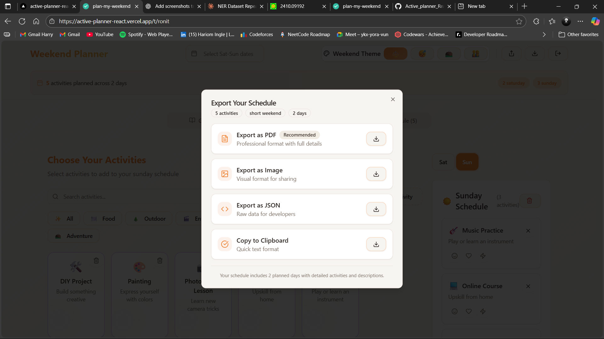

### Plan My Weekend

A modern, local-first Weekend Planner built with React + Vite + TypeScript, Tailwind, shadcn/ui, and Zustand. Create a private planning space, pick dates, curate activities, organize your schedule by day, set moods, export or share a read-only snapshot, and come back later — everything is persisted locally per space.

---

### Quick start

- **Install**: `npm install`
- **Run dev server**: `npm run dev`
- **Build**: `npm run build`
- **Preview build**: `npm run preview`
- **Lint**: `npm run lint`

Requires Node 18+.

---

### Key features

- **Private planning spaces (threads)**

  - Create or log into a space via `/create` or `/start` using a username + password.
  - Per-space state persisted with `zustand` + `localStorage` under a namespaced key.
  - Lightweight demo authentication: password is stored locally only for your browser.

- **Activity catalog**

  - Preloaded activities across categories: food, outdoor, entertainment, relax, learning, social, adventure.
  - **Search** and **filter by category**.
  - **Create custom activities** with icon, name, description, category.
  - **Delete from catalog**; automatically removes scheduled occurrences.

- **Schedule builder**

  - Supports weekend lengths: **short** (Sat–Sun), **long** (Fri–Sun), **extended** (Thu–Sun).
  - Add activities to a day, **reorder with drag-and-drop**, remove items, and set a **mood** per scheduled activity.
  - **Clear schedule** for the current day in one click.

- **Date planning**

  - Pick weekend dates via the **Weekend Date Picker**; automatically highlights the correct days based on weekend length.

- **Holiday awareness**

  - Shows upcoming Indian government/religious holidays for the next 2 weeks.
  - Suggests switching to 3- or 4-day weekends where appropriate.

- **Export & Share**

  - Export your plan as **PDF**, **PNG image**, **JSON**, or **copy-to-clipboard** text.
  - Generate a **shareable, read-only link** that renders a public view of your plan in this browser session.

- **Theming & UX**
  - Theme switcher, responsive layout, subtle micro-interactions, and accessible components from shadcn/ui.

---

### App overview

- **Start (login)**: `/start`
  - Enter username and password. If the space exists, validate locally and continue. If not, go to create.
- **Create (sign-up)**: `/create`
  - Create a new space with username + password.
- **Planner**: `/t/:threadId`
  - Main planning UI: header with date picker, share/export, theme; tabs for Activities and Schedule.
- **Shared read-only view**: `/shared/:shareId`
  - Public snapshot of a plan generated from Export/Share. Does not require login, and cannot be edited.

Routing is handled by `react-router-dom`.

---

### How it works (state)

State is managed with **Zustand** in `src/store/weekendStore.ts` and persisted using `zustand/middleware.persist`.

- **Threads (spaces)**: Each `threadId` stores its own `activities`, `schedule`, `currentTheme`, `weekendLength`, `availableDays`, `selectedWeekendDates`, and optional `ownerUsername`/`password`.
- **Authentication (demo/local only)**: `setThreadCredentials`, `validateThreadPassword`, `markThreadAuthenticated`, `isThreadAuthenticated` maintain a lightweight auth map in-memory + local. This is not a real backend auth.
- **Scheduling**:
  - `addActivity(day, activity)`, `removeActivity(day, scheduledId)`, `reorderActivities(day, activities)`.
  - `updateMood(day, scheduledId, mood)` for happy/relaxed/energetic.
  - `clearSchedule()` to empty the current day list.
- **Configuration**:
  - `setTheme(theme)`, `setWeekendLength(length)` automatically updates `availableDays`.
  - `setSelectedWeekendDates(dates)` stores the currently planned weekend dates.
- **Catalog management**:
  - `removeCatalogActivity(activityId)` deletes an activity from catalog and removes all its scheduled instances.
- **Sharing**:
  - `createShareableLink()` extracts a snapshot into `sharedPlans` and returns a `/shared/:id` URL.
  - `getSharedPlan(shareId)` reads that snapshot for the public page.

---

### Components and key interactions

- `Header`
  - Theme toggle, Weekend Date Picker, Share, Export, Logout.
  - Activity summary chips show counts per day.
- `WeekendDatePicker`
  - Highlights weekend days according to current `weekendLength` and saves selected dates.
- `HolidayAwareness`
  - Lists upcoming holidays (next 14 days) and suggests upgrading weekend length.
- `ActivityList`
  - Search, category filters, `CreateActivityDialog`, and grid of `ActivityCard`s.
- `ActivityCard`
  - Click to add to the current day. Optional delete button removes from catalog.
- `Schedule`
  - Tabs for days based on `availableDays`, DnD reordering via `@dnd-kit`, mood buttons, clear-day.
- `ScheduleItem`
  - Display of a scheduled activity with mood selection and remove button.
- `ExportDialog`
  - Export options: PDF, Image, JSON, Clipboard. Uses `jspdf` and `html2canvas`.

---

### Commands and scripts

- `npm run dev`: Start Vite dev server.
- `npm run build`: Production build.
- `npm run build:dev`: Development-mode build.
- `npm run preview`: Preview built app.
- `npm run lint`: Run ESLint.

Key dependencies: React 18, Vite 5, TypeScript, Tailwind, shadcn/ui (Radix), Zustand, `@dnd-kit`, `date-fns`, `react-router-dom`, `jspdf`, `html2canvas`.

---

### Preview

**Start / Login Page**

---


---


---



---


---


---


---


---

### Data model (high level)

- Activity: `{ id, name, icon, category, description }`
- ScheduledActivity: `Activity + { scheduledId, mood? }`
- Schedule: `{ thursday: [], friday: [], saturday: [], sunday: [] }`
- Weekend length → available days:
  - `short`: Saturday, Sunday
  - `long`: Friday, Saturday, Sunday
  - `extended`: Thursday, Friday, Saturday, Sunday

---

### Security and privacy

- This is a **local-first demo**. Authentication and data are stored in your browser’s `localStorage`.
- There is **no server** or real user account system; do not store sensitive data.
- Share links are only valid within the same browser session/storage — they’re snapshots in your local store, not uploaded.

---

### Tips & troubleshooting

- If you cannot access a space directly, navigate to `/start?id=:username` to log in.
- If you change weekend length and selected day disappears, the app automatically selects the first available day.
- Export requires browser permissions for downloads/clipboard; check your browser if blocked.

---

### WorkFlow

```mermaid
flowchart TD
    A[🏕️ Plan My Weekend] --> B[🔑 Create or Log in]
    B --> C[📅 Select Weekend Dates]
    C --> D[🎨 Curate Activities]
    D --> E[🗂️ Organize Schedule]
    E --> F[😊 Set Moods]
    F --> G[💾 `Persist - Local Storage`]
    G --> H[📤 Export / 🔗 Share]
    H -->|Loop| D

https://docs.google.com/document/d/1oFxEzABMw58F8aneSU10XvOrHmnnejtBzSsKqrW-aj8/edit?usp=sharing
